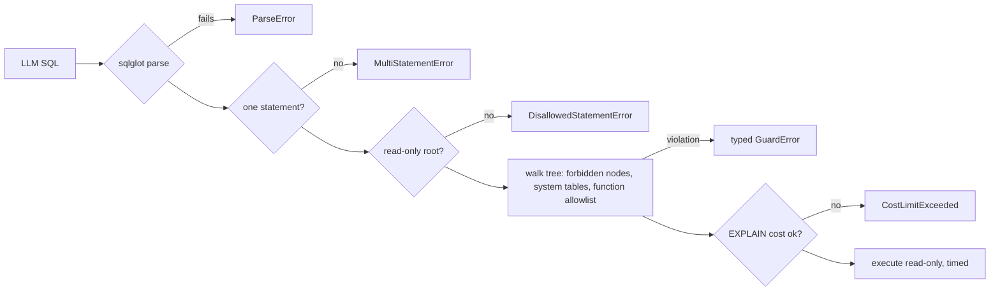

# sql-guardrails — make LLM-generated SQL safe to execute

[](https://github.com/darrshangovender/sql-guardrails/actions/workflows/tests.yml)
[](LICENSE)
[](https://python.org)
[](https://github.com/tobymao/sqlglot)

> Takes LLM-generated SQL, parses it with sqlglot, and rejects anything that isn't a single read-only statement over allowed tables and functions. Optional `EXPLAIN`-based cost limits and a read-only executor with a statement timeout. One runtime dependency.

**Why this exists.** Every natural-language-to-SQL system has the same problem: the model will eventually generate `DELETE FROM users`. Regex filtering for "DROP" fails on the first nested CTE, and it fails silently, which is the worst way to fail. Parsing to an AST and walking the whole tree is the only approach that holds.

**The narrow sibling of [guardrail](https://github.com/darrshangovender/guardrail)**, which does input and output validation for LLM traffic in general. This one does a single surface — generated SQL — properly. Extracted from [insightengine](https://github.com/darrshangovender/insightengine).

---

## Quick start

```bash
pip install -e ".[dev]"      # one runtime dependency: sqlglot
```

```python
from sql_guardrails import Guard, AllowList, GuardError

guard = Guard(dialect="postgres", allowlist=AllowList(), strict_system_tables=False)

r = guard.check("SELECT user_id, COUNT(*) FROM events GROUP BY user_id")
print(r.safe, r.normalized_sql)      # True, 'SELECT ...'

print(guard.check("WITH x AS (DELETE FROM users RETURNING id) SELECT * FROM x").safe)   # False

try:
    guard.check_or_raise("SELECT pg_sleep(60)")
except GuardError as e:
    print(type(e).__name__, e.reason)   # DisallowedFunctionError ...
```

With cost limits and execution:

```python
import sqlite3
from sql_guardrails import Guard, Executor, SQLiteCostEstimator

conn = sqlite3.connect("warehouse.db")
executor = Executor(
    connection=conn,
    guard=Guard(dialect="sqlite"),
    cost_estimator=SQLiteCostEstimator(
        connection=conn, table_rowcounts={"events": 1_000_000}, max_cost=10_000,
    ),
    statement_timeout_ms=8_000,
    enforce_read_only=True,
)
result = executor.execute(llm_generated_sql)
print(result.columns, result.rows, result.normalized_sql)
```

## How it works



1. Parse with sqlglot in the target dialect. **A parse failure is a rejection**, not a pass — if the guard can't understand the query it has no basis for calling it safe.
2. Reject more than one top-level statement, which kills stacked-query injection.
3. Require a read-only root node: `Select`, `Union`, `Intersect`, `Except`, `Subquery`, or a `With` wrapping one.
4. Walk the **entire tree** for 17 forbidden node types — DML, DDL, privilege and session commands — so a write buried in a CTE or subquery is caught.
5. Check every table reference against blocked schemas and prefixes (`pg_catalog`, `pg_toast`, `mysql`, `sys`, `performance_schema`, any `pg_` prefix; `information_schema` in strict mode).
6. Check every function against the allowlist. ~90 safe functions are permitted; 24 are permanently blocked and cannot be re-enabled by configuration.
7. Optionally run `EXPLAIN` and reject on estimated cost or row count.
8. Execute with a statement timeout and a read-only session setting.

## What it defends against

| Threat | Covered | How |
|---|---|---|
| Destructive operations | **yes** | Full-tree node walk, including inside CTEs, subqueries and unions |
| Stacked queries | **yes** | Exactly-one-statement check |
| Schema discovery | **yes** | System schema and `pg_` prefix blocking; `information_schema` opt-in |
| Resource exhaustion | partial | `EXPLAIN` cost and row estimates, if you wire up an estimator |
| Data exfiltration via answer text | **no** | A different problem — that's output filtering, see [guardrail](https://github.com/darrshangovender/guardrail) |
| Timing side channels | **no** | Out of scope |
| Compromised database credentials | **no** | Out of scope |
| Cross-tenant reads | **no** | Use row-level security on the connection; the guard checks query *shape*, not row visibility |

Eight typed errors — `ParseError`, `MultiStatementError`, `DisallowedStatementError`, `DisallowedFunctionError`, `DisallowedTableError`, `CostLimitExceeded`, `RowLimitExceeded` — all under a `GuardError` base, so a caller can decide what to log, what to retry, and what to alert on.

## Design decisions

| Decision | Why |
|---|---|
| **AST walk, not regex** | `WITH x AS (DELETE FROM users RETURNING id) SELECT * FROM x` contains no top-level `DELETE` for a string filter to find. This is the whole reason the library exists. |
| **Fail closed on a parse error** | Every other tool in this space treats an unparseable query as "probably fine". It is the opposite. |
| **A permanently-blocked function set** | Some functions — file access, sleep, command execution — should never be re-enabled by a config file someone edits under deadline. Configuration can widen the allowlist, never the blocklist. |
| **Typed errors, not a boolean** | "Unsafe" is not actionable. "Disallowed function `pg_sleep`" tells the operator whether this is an attack, a prompt bug, or an allowlist that's too narrow. |
| **One runtime dependency, no DB drivers** | This sits in the security path of somebody else's application. It should add sqlglot and nothing else. Drivers are the caller's business. |

## Limitations

- **The raw SQL is executed, not the validated AST.** The executor runs the caller's original string while the safety decision was made on the parsed tree; `normalized_sql` is only attached to the result. Any construct sqlglot parses differently from the target engine — dialect drift, engine-specific extensions — is a bypass by construction. Executing `normalized_sql` would close this and is the highest-value change available.
- **`check_or_raise` routes exceptions by substring-matching its own English reason text.** Rewording a reason message silently changes which exception type callers catch, and the `"table"` branch would catch any unrelated reason containing that word.
- **Function-name resolution falls back to a class name the allowlist can't match.** sqlglot renames functions per dialect — the allowlist already has to carry both `DATE_TRUNC` and `TIMESTAMP_TRUNC` for this reason. Any other rewrite produces an unrecognised name and a false-positive rejection of a legitimate query.
- **There is no join-count cap.** A test documents the omission as deliberate — join count is a poor proxy for cost and blocks legitimate analytics. Use the cost estimator instead. The `max_joins` option the old README advertised never existed.
- **The SQLite timeout is best-effort and leaks a background timer.** A `threading.Timer` is installed per `execute()` and never cancelled, so timers accumulate and one can abort a *later* statement on the same connection.
- **The cost estimator interpolates unvalidated SQL into an `EXPLAIN` string.** This is only safe because it runs after the guard, and nothing in the class enforces that ordering — yet `PostgresCostEstimator` is public and independently constructible.
- **`SQLiteCostEstimator` matches table names by naive substring**, so a rowcount entry for `user` matches a scan of `users` and silently mis-costs the query.
- **`cost_estimator.py` and `executor.py` have zero test coverage.** Everything that runs against a live database is untested; only the AST guard and the allowlist are exercised.
- **The previously advertised API did not exist.** The old README documented a `Policy` class with `allow` / `deny` lists, `max_joins`, `max_estimated_cost` and `timeout_seconds` on the `Guard`, plus a `UnsafeSQLError` and an audit log. None of those exist — there is no logging module and no audit sink anywhere in the package. The real surface is documented above. The old "~150 adversarial SQL strings" red-team corpus does not exist either; the repo ships 27 attack cases as parametrised tests.

## Project layout

```
sql-guardrails/
├── sql_guardrails/
│   ├── ast_guard.py          # Guard: parse · statement count · root · node walk · tables · functions
│   ├── function_allowlist.py # ~90 safe functions, 24 permanently blocked
│   ├── cost_estimator.py     # Postgres EXPLAIN (FORMAT JSON) · SQLite EXPLAIN QUERY PLAN
│   ├── executor.py           # guard → cost → session settings → execute
│   └── errors.py             # 8 typed errors under GuardError
└── tests/                    # 29 test functions, ~89 parametrised cases
```

## Tests

```bash
pytest tests/ -q
```

The suite is the specification: **27 adversarial strings that must be rejected with a matching reason**, and **20 legitimate analytics queries that must pass** — so a change that tightens the guard into blocking real work fails the build just as loudly as one that lets an attack through. Plus parametrised coverage of allowed and permanently-blocked function names. CI runs it on every push.

## Author

Darrshan Govender · [Agulhas Code](https://agulhascode.co.za) · Durban, South Africa
